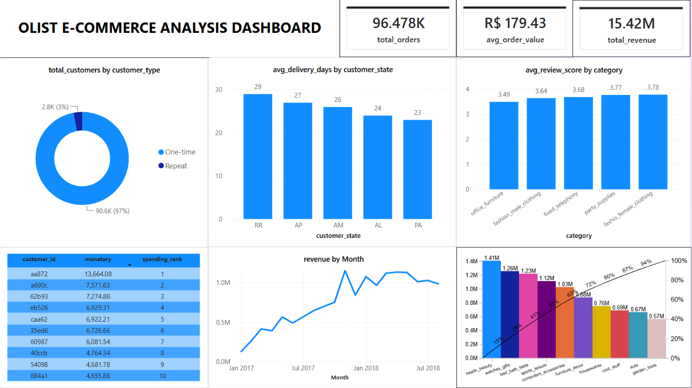

# 🛒 Olist E-Commerce Analysis — Python | SQL | Power BI

Phân tích dữ liệu bán hàng thương mại điện tử Brazil nhằm trả lời 3 câu hỏi kinh doanh cốt lõi: **Tình hình kinh doanh hiện tại ra sao? Ai là khách hàng tốt nhất? Điều gì đang cản trở tăng trưởng?**

Dự án mô phỏng đầy đủ quy trình làm việc thực tế của một Data Analyst: từ làm sạch dữ liệu thô, mô hình hóa và phân tích bằng SQL, đến trực quan hóa insight trên dashboard tương tác.


---

## 📌 Mục lục
- [Tổng quan dự án](#tổng-quan-dự-án)
- [Nguồn dữ liệu](#nguồn-dữ-liệu)
- [Kiến trúc & Quy trình](#kiến-trúc--quy-trình)
- [Data Cleaning — Các quyết định quan trọng](#data-cleaning--các-quyết-định-quan-trọng)
- [Phân tích SQL](#phân-tích-sql)
- [Dashboard Power BI](#dashboard-power-bi)
- [Insight chính](#insight-chính)
- [Cấu trúc thư mục](#cấu-trúc-thư-mục)
- [Công cụ sử dụng](#công-cụ-sử-dụng)

---

## Tổng quan dự án

**Olist** là một sàn thương mại điện tử tại Brazil, kết nối các nhà bán hàng nhỏ lẻ với nhiều kênh bán hàng khác nhau. Dự án sử dụng bộ dữ liệu công khai **Brazilian E-Commerce Public Dataset** (~100.000 đơn hàng, 2016–2018) để trả lời 3 nhóm câu hỏi:

| Phần | Câu hỏi kinh doanh |
|---|---|
| **1. Business Overview** | Doanh thu, số đơn hàng, giá trị đơn trung bình đang ở mức nào? Xu hướng tăng trưởng ra sao? Danh mục sản phẩm nào đóng góp doanh thu nhiều nhất? |
| **2. Who are our best customers?** | Khách hàng chi tiêu nhiều nhất là ai? Bao nhiêu % khách hàng quay lại mua thêm? |
| **3. What's holding us back?** | Khu vực nào giao hàng chậm nhất? Danh mục sản phẩm nào bị đánh giá thấp nhất? |

**Luồng xử lý dữ liệu:**

```
Raw CSV (Kaggle) → Python (EDA + Cleaning) → SQL Server (Modeling + Views) → Power BI (Dashboard)
```

---

## Nguồn dữ liệu

- **Dataset:** [Brazilian E-Commerce Public Dataset by Olist](https://www.kaggle.com/datasets/olistbr/brazilian-ecommerce) (Kaggle)
- **Quy mô:** ~100.000 đơn hàng, 9 bảng dữ liệu liên kết (khách hàng, đơn hàng, sản phẩm, thanh toán, đánh giá, người bán, vị trí địa lý...)
- **Thời gian:** 2016–2018

---

## Kiến trúc & Quy trình

Dự án áp dụng ý tưởng kiến trúc **Bronze – Silver – Gold** (đơn giản hóa cho quy mô cá nhân):

| Layer | Nội dung | Công cụ |
|---|---|---|
| 🟫 **Bronze** | Dữ liệu thô, giữ nguyên gốc từ Kaggle | Python (pandas) |
| ⬜ **Silver** | Dữ liệu đã làm sạch: xử lý trùng lặp, missing values, sai định dạng, kiểm tra tính toàn vẹn giữa các bảng | Python (pandas) → SQL Server |
| 🟨 **Gold** | Các SQL View tổng hợp sẵn, phục vụ trực tiếp cho phân tích và dashboard | SQL Server (Views) → Power BI |

### Các bước thực hiện

1. **Python — EDA & Cleaning:** Load 9 file CSV, khảo sát tổng quan, xử lý missing values và duplicate, kiểm tra tính toàn vẹn dữ liệu (referential integrity) giữa các bảng.
2. **SQL Server — Modeling & Analysis:** Import dữ liệu sạch, viết 8 câu query phân tích chính, đóng gói thành **8 SQL Views** để tái sử dụng.
3. **Power BI — Dashboard:** Kết nối trực tiếp vào SQL Server (Import mode), xây dựng dashboard 1 trang gồm 3 phần tương ứng 3 câu hỏi kinh doanh.

---

## Data Cleaning — Các quyết định quan trọng

Đây là những vấn đề chất lượng dữ liệu thực tế đã gặp phải và cách xử lý — phản ánh tư duy phân tích, không chỉ đơn thuần chạy code:

| Vấn đề phát hiện | Quyết định xử lý | Lý do |
|---|---|---|
| Bảng `geolocation` có ~262.000 dòng trùng lặp (nhiều tọa độ ứng với cùng 1 zip code) | Gộp về 1 dòng/zip code bằng giá trị trung bình lat/lng | Mục đích phân tích chỉ cần cấp độ khu vực, không cần độ chính xác từng mét |
| Cột `geolocation_city` bị lỗi chính tả nghiêm trọng, không nhất quán | Loại bỏ cột city, chỉ giữ `state` (đã chuẩn hóa sẵn) | State đáng tin cậy hơn nhiều cho phân tích theo khu vực; đánh đổi hợp lý giữa độ chi tiết và độ chính xác |
| 8 đơn hàng có `order_status = 'delivered'` nhưng thiếu ngày giao hàng thực tế | Giữ nguyên NULL, loại khỏi các phép tính thời gian giao hàng | Số lượng không đáng kể (0.008%); đây là lỗi ghi nhận dữ liệu gốc, không nên tự ý điền giá trị giả |
| 610 sản phẩm thiếu toàn bộ thông tin danh mục & metadata | Điền `category = 'unknown'`, metadata = 0 | Giữ lại dòng dữ liệu (vì vẫn có đơn hàng liên quan) thay vì xóa, tránh mất dữ liệu order_items |
| Nhiều danh mục sản phẩm chỉ có vài đơn hàng/review | Áp dụng `HAVING COUNT(...) >= 30` khi phân tích theo danh mục | Tránh kết luận sai lệch từ cỡ mẫu quá nhỏ |
| 3 tháng đầu dataset (09/2016 – 12/2016) có doanh thu gần như bằng 0 | Loại khỏi phân tích xu hướng theo tháng | Đây là giai đoạn soft-launch của nền tảng, không đại diện cho hoạt động kinh doanh thực tế |

---

## Phân tích SQL

8 câu hỏi phân tích được đóng gói thành 8 SQL View, sử dụng: `JOIN`, `GROUP BY`, `HAVING`, `CTE`, Subquery, Window Functions (`LAG`, `RANK`), `CASE WHEN`.

| View | Câu hỏi trả lời | Kỹ thuật chính |
|---|---|---|
| `vw_business_overview` | Tổng doanh thu, số đơn hàng, AOV | Subquery, Aggregation |
| `vw_monthly_revenue` | Doanh thu theo tháng & tăng trưởng MoM | CTE, `LAG()` |
| `vw_category_revenue` | Doanh thu theo danh mục sản phẩm | JOIN, `GROUP BY` |
| `vw_customer_rfm` | Recency – Frequency – Monetary từng khách hàng | CTE, `CROSS JOIN`, `DATEDIFF` |
| `vw_customer_ranking` | Xếp hạng khách hàng theo chi tiêu | `RANK()` |
| `vw_customer_repeat_rate` | Tỷ lệ khách mua 1 lần vs mua lại | `CASE WHEN`, Window Function |
| `vw_delivery_by_state` | Thời gian giao hàng theo khu vực | `AVG`, `HAVING` |
| `vw_review_by_category` | Điểm đánh giá theo danh mục sản phẩm | `AVG`, `HAVING` |

📄 Toàn bộ câu lệnh SQL chi tiết: xem thư mục [`/sql`](./sql)

---

## Dashboard Power BI

Dashboard 1 trang, kết nối trực tiếp SQL Server → Power BI (Import mode), gồm 3 khu vực tương ứng 3 phần câu chuyện phân tích:



**Business Overview:** Card tổng quan (đơn hàng, AOV, doanh thu) · Biểu đồ doanh thu theo tháng · Top danh mục theo doanh thu (Pareto chart)

**Customer:** Tỷ lệ khách mua 1 lần vs mua lại · Bảng Top 10 khách hàng chi tiêu nhiều nhất

**Operations:** Thời gian giao hàng trung bình theo bang · Điểm đánh giá trung bình theo danh mục sản phẩm

📊 File Power BI: [`/powerbi/olist_ecommerce_dashboard.pbix`](./powerbi)

---

## Insight chính

- 📈 **Doanh thu tăng trưởng mạnh trong 2017**, đạt đỉnh vào tháng 11/2017 (mùa mua sắm cuối năm), sau đó bước vào giai đoạn ổn định/bão hòa trong suốt 2018.
- 💄 **`health_beauty`** là danh mục đóng góp doanh thu lớn nhất, theo sau bởi `watches_gifts` và `bed_bath_table`.
- ⚠️ **97% khách hàng chỉ mua đúng 1 lần**, chỉ 3% quay lại mua thêm — đây là vấn đề retention nghiêm trọng, gợi ý doanh nghiệp nên đầu tư vào chương trình giữ chân khách hàng thay vì chỉ tập trung vào thu hút khách mới.
- 🚚 **Khu vực miền Bắc Brazil (RR, AP, AM)** có thời gian giao hàng trung bình 26–29 ngày, gấp hơn 3 lần so với **São Paulo** (8 ngày) — phản ánh rõ khoảng cách địa lý và hạ tầng logistics ảnh hưởng trực tiếp đến trải nghiệm khách hàng.
- ⭐ **`office_furniture`** là danh mục bị đánh giá thấp nhất (3.49/5), trong khi các danh mục **sách** đều đạt trên 4.3/5 — gợi ý vấn đề chất lượng đóng gói/vận chuyển với các mặt hàng cồng kềnh, dễ hư hỏng.

---

## Cấu trúc thư mục

```
olist-ecommerce-analysis/
├── data/
│   └── raw/                          # Dữ liệu gốc từ Kaggle
├── python/
│   └── 01_eda_cleaning.ipynb         # EDA & Data Cleaning
├── sql/
│   ├── 01_views_business_overview.sql
│   ├── 02_views_customer.sql
│   └── 03_views_operations.sql
├── powerbi/
│   └── olist_ecommerce_dashboard.pbix
├── images/
│   ├── dashboard_full.png
│   └── dashboard_overview.png
└── README.md
```

---

## Công cụ sử dụng

- **Python** (pandas) — Thu thập, khảo sát & làm sạch dữ liệu
- **SQL Server / SSMS** — Modeling dữ liệu, viết query phân tích, tạo Views
- **Power BI Desktop** — Xây dựng dashboard trực quan

---

## Tác giả

Dự án cá nhân được thực hiện nhằm mục đích luyện tập kỹ năng Data Analyst — bao gồm data cleaning, SQL analysis và data visualization trên một bộ dữ liệu thực tế.

📫 Liên hệ: *nguyenhaintnh304@gmail.com*
